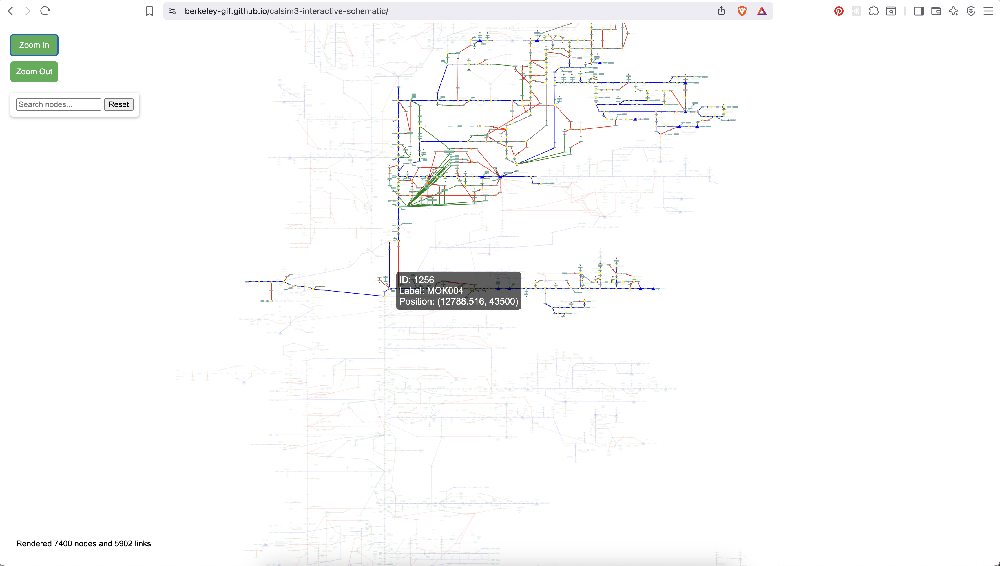

# CalSim3 Interactive Schematic

An interactive, proof-of-concept visualization of the CalSim3 water network schematic for the COEQWAL project. It renders the nodes (reservoirs, junctions, demand units, treatment plants, etc.) and arcs (channels, canals, deliveries, returns) of California's water system, with zoom, search, tooltips, and upstream/downstream highlighting.

Built with [Vite](https://vitejs.dev/) and [D3 v7](https://d3js.org/). No framework.

## Screenshot

See what is upstream and downstream:



---

## Views

The project ships three independent pages. Each is a separate Vite entry point that loads one ES module.

| Page | Module | Data source | Status |
|------|--------|-------------|--------|
| `index.html` | `networkDiagram.js` | Static `public/data/json/networkSchematic.json` | **Working** Uses layout coordinates from the CalSim diagram. |
| `index-api.html` | `networkDiagramAPI.js` | COEQWAL database API | Prototype. Needs an adapter (see [Connecting to the COEQWAL API](#connecting-to-the-coeqwal-api)). |
| `index-map.html` | `mapNetworkDiagram.js` | COEQWAL database API | Prototype. Plots nodes geographically by lat/lon. |

The two API views were written against earlier API endpoints and do not work against the current COEQWAL API without changes.

## Quick start

Requires **Node 22** (see `.nvmrc`).

```bash
nvm use            # selects Node 22
npm install
npm run dev        # starts Vite on http://localhost:3000
```

`npm run dev` opens the static schematic (`index.html`). The other views are at `http://localhost:3000/index-api.html` and `http://localhost:3000/index-map.html`, but they require a running backend (see below).

### Build and preview

```bash
npm run build      # outputs to dist/
npm run preview    # serves the production build locally
```

Note: `vite.config.js` only lists `index.html` as a build input, so `npm run build` bundles only the static schematic. The API/map pages are dev-only unless added to `rollupOptions.input`.

## How the static view works

1. `networkDiagram.js` fetches `public/data/json/networkSchematic.json`.
2. It reads `Diagram.Nodes[0].Node` and `Diagram.Links[0].Link`.
3. Each node's `Bounds` (`"x,y,width,height"`) becomes an absolute SVG position. Link ARGB colors are converted to RGBA.
4. D3 renders an SVG with shapes per `Shape.Id` (ellipse, triangle, cylinder, rectangle), plus zoom, a search box, hover tooltips, and upstream/downstream highlighting.

This is the only view that reproduces the true CalSim schematic layout, because those layout coordinates live only in the source diagram, not in the database.

## Data pipeline

The schematic data originates as a CalSim3 diagram XML and is converted to JSON offline. These are one-off/maintenance scripts, not part of the running app.

| Script | Purpose |
|--------|---------|
| `convertXmlToJson.js` | Converts `data/xml/CS3_NetworkSchematic_Integrated_11.28.23.xml` (UTF-16BE) to `data/json/networkSchematic.json`. |
| `generateCSV.js` + `exportData.js` | Reads the schematic JSON and writes `data/nodes_data.csv` and `data/links_data.csv`. |

> Note: `convertXmlToJson.js` uses CommonJS `require()` while the package is ESM (`"type": "module"`), and it reads/writes `./data/...` rather than `./public/data/...`. It needs a small update before it will run again.

### Analysis scripts (`scripts/`)

Standalone Python helpers used during data exploration:

- `find_inflows.py` - maps reservoir codes in `data/storage.txt` to schematic node IDs (writes `output.txt`).
- `seek_upstream.py` - finds all upstream nodes for each reservoir (writes `upstream_output.txt`).

## Node and arc type reference

`data/node_types.csv` and `data/arc_types.csv` are reference tables (sourced from the COEQWAL geopackage) describing every node/arc type code, e.g. `STR` = storage/reservoir, `JUNC` = junction, `CH-CNL` = canal, `WTP` = water treatment plant. Nothing reads these CSVs at runtime; they serve as documentation. The static view colors elements by diagram shape (`Shape.Id`), and the API prototypes color by numeric type ID, neither consults these tables.

## Connecting to the COEQWAL API

The API views target the `coeqwal-data-platform` API (`api.coeqwal.org`, or `localhost:8000` locally). The data exists, but the current frontend does not match the current API endpoints.

Differences that must be reconciled before the API views work:

- **Endpoints:** the frontend calls `/network_node` / `/network_arc`. The API serves `/api/nodes` / `/api/arcs`. (Adjustable at runtime in the `index-api.html` config panel.)
- **Visibility filter:** the frontend requires `integration_status === 'active'`, a field the API does not return, so every node/arc is filtered out. Map this to the database's `operational_status` or remove the filter.
- **Geometry:** the API returns a parsed `geojson` object plus top-level `latitude`/`longitude`. The frontend reads a `geom` string. The map view should read `latitude`/`longitude` or `geojson`.
- **Layout:** the schematic view relies on `diagram_id` for fallback positioning, which the API does not provide. The database has geographic geometry but not the schematic canvas layout, so the API can drive a geographic map but cannot reproduce the hand-laid schematic.
- **Types:** the API returns type names (`node_type`, `arc_type`) and node short codes for `from_node`/`to_node`, rather than the numeric IDs the frontend expects.

In short: the map view is achievable with a modestly-easy adapter. The schematic view cannot be faithfully reproduced from the API because the layout data is not in the database.
